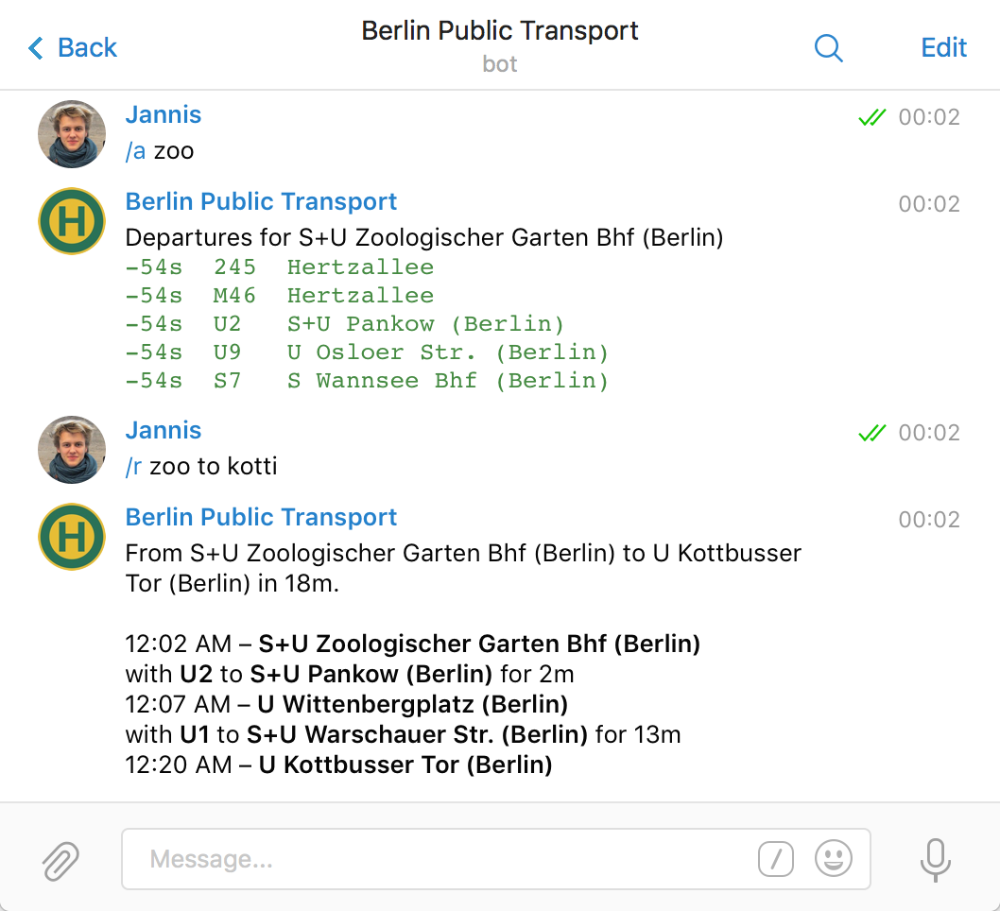

# *vbb-telegram*

**A Telegram bot for Berlin & Brandenburg public transport.**



[](https://www.npmjs.com/package/vbb-telegram)
[](https://david-dm.org/derhuerst/vbb-telegram)


## Installing

```shell
git clone https://github.com/derhuers/vbb-telegram.git; cd vbb-telegram
npm install
npm start
```


## Usage

You can use this bot to check public transport departures in Berlin & Brandenburg.

`/departure <station>` – Show the next departures.
`/route <a> to <b>` – Get routes from A to B.

If you send a location, it will respond with the closest stations.


## Contributing

If you **have a question**, **found a bug** or want to **propose a feature**, have a look at [the issues page](https://github.com/derhuerst/vbb-telegram/issues).
